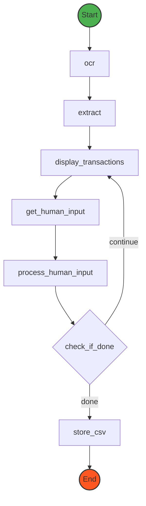

# WizLedger - Monthly Statement Processor

## Introduction

This project demonstrates a credit card statement assistant that can process PDF statements, perform OCR, and use LangGraph for AI-based transaction corrections.

### Demo

https://github.com/user-attachments/assets/a7f5a839-c7bd-4598-bdfe-9c2168008657

### Try it on HuggingFace

https://huggingface.co/spaces/chinkanai/wizledger

## Technologies

-   LangGraph
-   Google Cloud Vision API [Google Cloud Vision API](https://cloud.google.com/vision)
-   OpenRouter API (for access Claude 3.5 Sonnet) [OpenRouter API](https://openrouter.ai/)
-   pdf2image (optional) [pdf2image](https://pdf2image.readthedocs.io/en/latest/)

## LangGraph

Here is the graph of the workflow:



## Prerequisites

-   Python 3.10 or later
-   OpenRouter API key (Get it [here](https://openrouter.ai/))
-   Enable Google Cloud Vision API (Get service account keys [here](https://cloud.google.com/iam/docs/keys-list-get))
-   Poppler (for pdf2image, optional)

## Installation

1. Clone this repository:

    ```bash
    git clone https://github.com/chinkan/demo-ai-statement-extract
    cd demo-ai-statement-extract
    ```

2. Configure environment variables:

    - Copy `.env.example` to `.env`
    - Fill in the variables in the `.env` file

3. Run it

    - On Windows

    ```bash
    run.bat
    ```

    - On Linux or MacOS

    ```bash
    ./run.sh
    ```

## Output

Processed data will be saved in the `output` folder.

## Docker run from build local

```bash
docker build -t wizledger .
docker run -d -p 7860:7860 wizledger
```

## Docker run from huggingface

```bash
docker run -it -p 7860:7860 --platform=linux/amd64 \
	-e OPENROUTER_MODEL="anthropic/claude-3.5-sonnet" \
	-e OPENROUTER_API_URL="https://openrouter.ai/api/v1/chat/completions" \
	-e OPENROUTER_API_KEY="<replace with your openrouter api key>" \
	-e CLOUD_VISION_API_KEY="<replace with your cloud vision api key>" \
	registry.hf.space/chinkanai-wizledger:latest python src/ui.py
```

## API

```python
import requests
import json
# Process a new statement
url = "http://localhost:7860/process"
files = {
    'statement': ('statement.pdf', open('path/to/statement.pdf', 'rb'), 'application/pdf'),
    'cloud_vision_api_key': ('key.json', open('path/to/cloud_vision_key.json', 'rb'), 'application/json')
}
data = {
    'openrouter_api_key': 'your_openrouter_api_key', # Your OpenRouter API key
    'openrouter_model': 'anthropic/claude-3.5-sonnet', # Recommend to use Claude 3.5 Sonnet, but you can use other models
    'openrouter_api_url': 'https://openrouter.ai/api/v1/chat/completions' # Compatible with OpenAI API
}
response = requests.post(url, files=files, data=data)
result = response.json()
print(result['result'])
thread_id = result['thread_id']

# Continue processing
url = "http://localhost:7860/continue_processing"
data = {
    'human_input': 'Some human input',
    'thread_id': thread_id
}
response = requests.post(url, data=data)
print(response.json())
result = response.json()

# Export transactions
url = "http://localhost:7860/export_transactions"
data = {'output': json.dumps(result)}
response = requests.post(url, data=data)
print(response.json())
```

## Contributing

We welcome contributions! To contribute to the project:

1. Fork the repository.
2. Create a new branch for your feature or bug fix.
3. Make your changes and commit them.
4. Push to your branch and create a pull request.

## License

This project is licensed under the MIT License.
