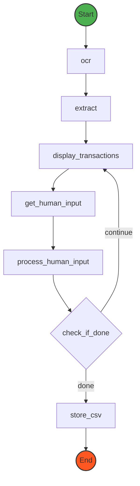

# Credit Card Statement Assistant

## Introduction

This project demonstrates a credit card statement assistant that can process PDF statements, perform OCR, and use LangGraph for AI-based transaction corrections.

## Technologies

-   LangGraph
-   Google Cloud Vision API
-   pdf2image
-   OpenRouter API (for access Claude 3.5 Sonnet)

## LangGraph

Here is the graph of the workflow:



## Prerequisites

-   Python 3.10 or later
-   [OpenRouter](https://openrouter.ai/) API key
-   [Google Cloud Vision API](https://cloud.google.com/vision) key
-   [Poppler](https://poppler.freedesktop.org/) (for pdf2image)

## Installation

1. Clone this repository:

    ```bash
    git clone https://github.com/chinkan/demo-ai-statement-extract
    cd demo-ai-statement-extract
    ```

2. Create and activate a virtual environment:

    ```bash
    python -m venv venv
    source venv/bin/activate  # On Windows use `venv\Scripts\activate`
    ```

3. Install dependencies:

    ```bash
    pip install -r requirements.txt
    ```

4. Configure environment variables:
    - Copy `.env.example` to `.env`
    - Fill in the variables in the `.env` file

## Usage

Place your monthly credit card statement PDF file in the `input` folder.

Run the main program:

```bash
python src/main.py
```

## Output

Processed data will be saved in the `output` folder.

## Contributing

We welcome contributions! To contribute to the project:

1. Fork the repository.
2. Create a new branch for your feature or bug fix.
3. Make your changes and commit them.
4. Push to your branch and create a pull request.

## License

This project is licensed under the MIT License.
